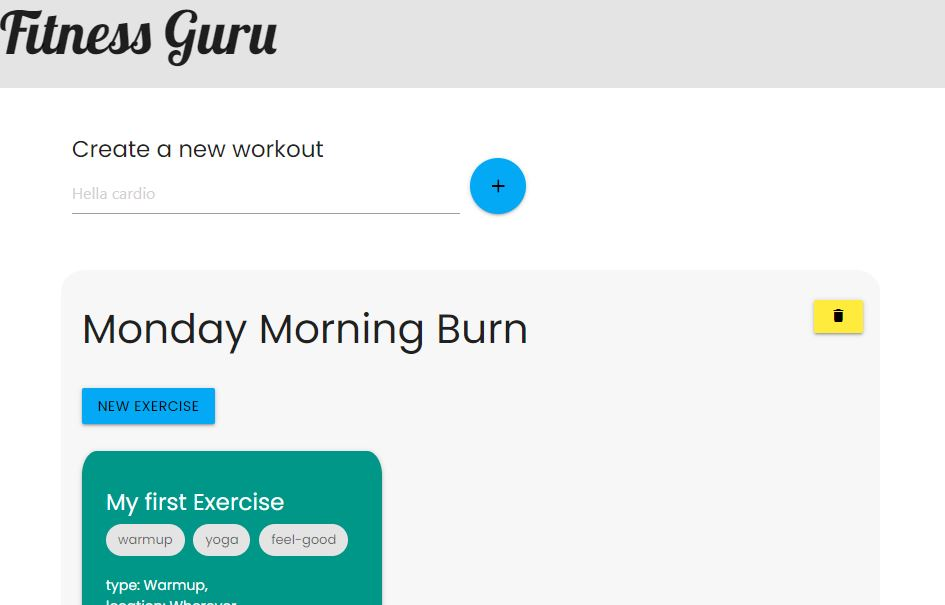

# Fitness Guru
  
  
  
  ## Description 
  Keeping track of workouts, exercersies, and activities can be a drag. There are so many to choose from, yoga, biking, lifting, all that! Fitness Guru can help. This application built using express, express-handlebars, mongoose,and backed of course by a mongoDB instance can either be installed locally, or you can visit the live site deployed here [Fittness Guru](https://stark-tundra-18774.herokuapp.com/)
  
  ## Table of Contents
  * [Installation](#installation)
  * [Usage](#usage)
  * [Credits](#credits)
  * [License](#license)
  * [Contributions](#contributing)
  * [Tests](#tests)
  
  ## Installation 
  - Clone git repo. 
  - NPM install for dependenies. 
  - You will need to create a mongoDB instace. 
  - Then in server.js change the mongoose.connect to use the database you create in your instace
  
  ## Usage
  Start by addinga workout, to do this type a name in the top input and use the + button. You will see your new workout in the top of the list. From there you can use your first exercise as a template and edit that card OR create new exercises to associate with that workout. You may at any time also delete workouts using the yellow trashcan, or delete exercises from the workout itself.
  
  ## Credits
  Thanks to MongoDB Atlas for a free tier, as well as the folks putting together mongoose. Very easy to use indeed
  
  ## License
  MIT
  
  ## Contributing
  Not accepting contributions at this time
  
  ## Tests
  none
  
  ## Questions
  Have quesitons about this repo? Please reach out on github or via email
  * [clubkemp](https://github.com/clubkemp)
  * kempj2.jk@gmail.com